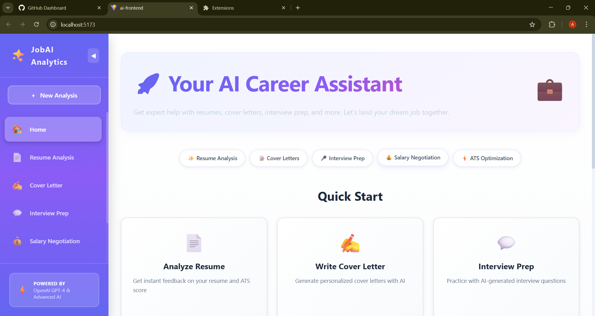
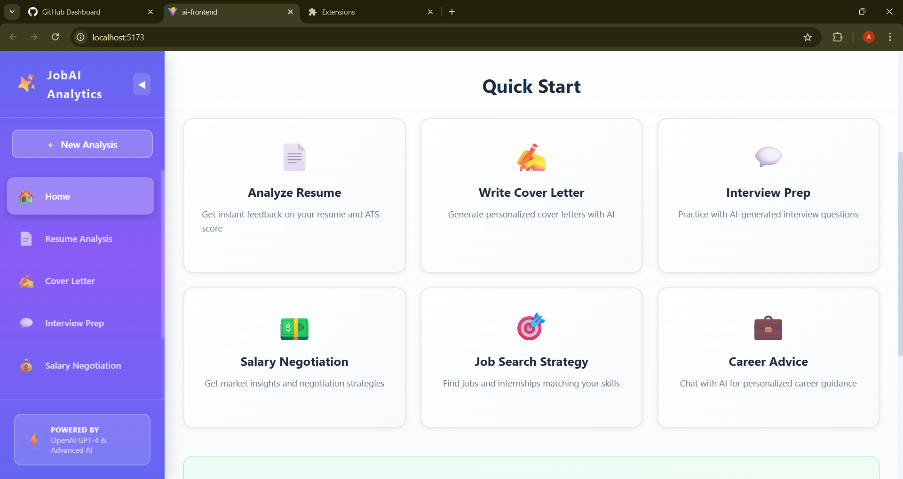
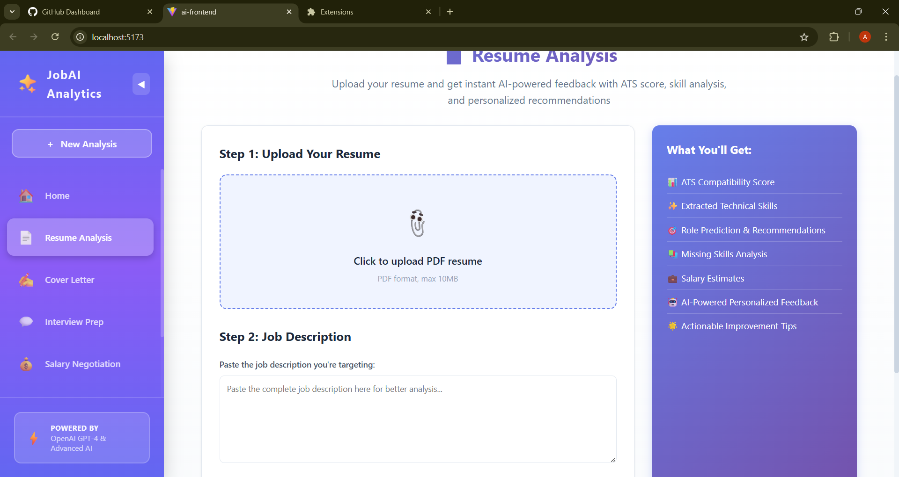
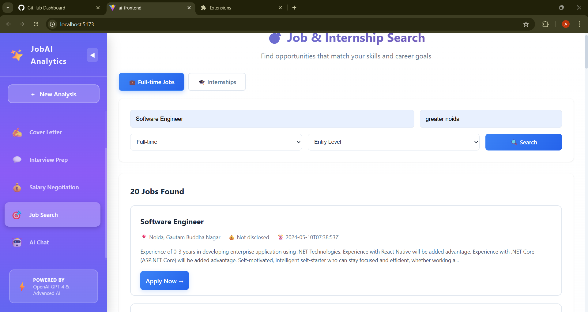
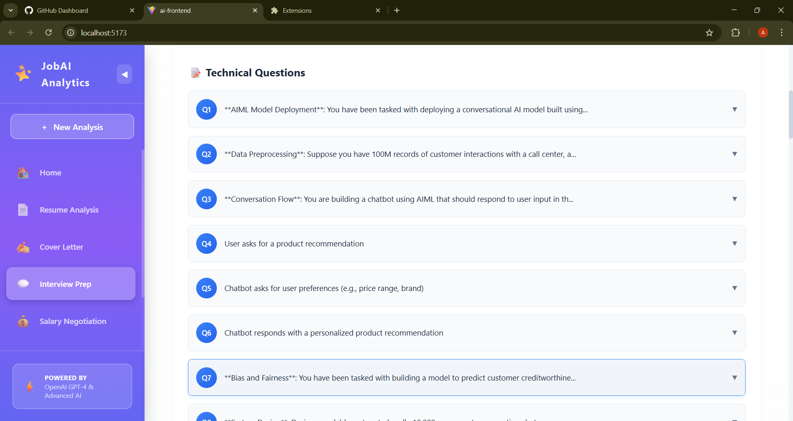
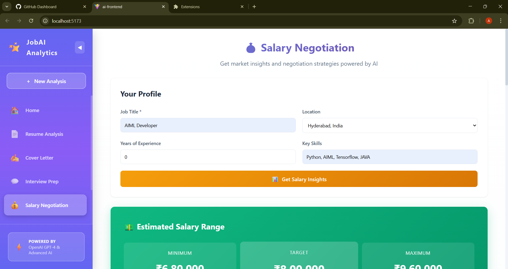
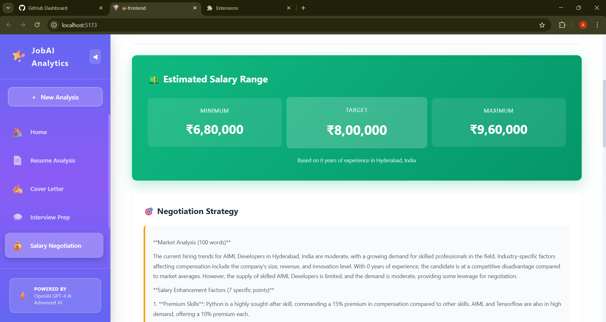
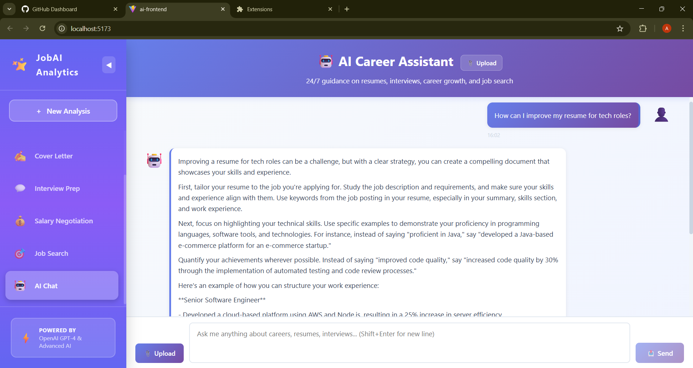
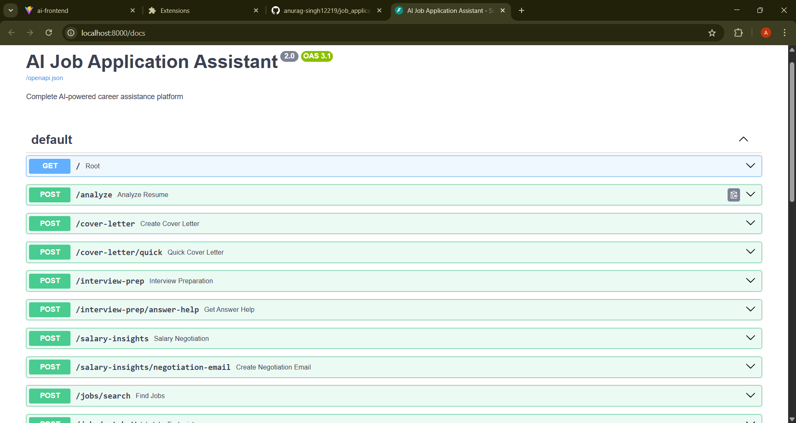

# AI Job Application Assistant

[](https://www.python.org/)
[](https://fastapi.tiangolo.com/)
[](https://react.dev/)
[](LICENSE)
[](https://github.com/anurag-singh12219/job_application_assistant)

A **production-ready, full-stack web application** that combines classical algorithms with AI to help job seekers with resume optimization, job matching, interview preparation, and salary negotiation.

### ✨ Key Highlights

✅ **Real Algorithm Implementation** - 65% algorithmic work (TF-IDF, fuzzy matching, ML)  
✅ **Smart AI Integration** - 35% AI-assisted features (interview prep, cover letters, chat)  
✅ **Complete Working Application** - Backend + Frontend fully integrated  
✅ **Comprehensive Documentation** - 2,000+ lines of technical docs  
✅ **Production-Grade Code** - Error handling, async, CORS, validation  

---

## 🌐 Live Demo

**🚀 Try it now - No installation required!**

- **Live App**: https://s-kill-sync.vercel.app
- **API Backend**: https://skillsync-cyf1.onrender.com


*Note: Free tier - first request may take 30 seconds to wake up*

---

## 📚 Quick Links

**Getting Started:**
- 🚀 **[SETUP.md](SETUP.md)** - Installation & testing (start here)
- 🏗️ **[DOCUMENTATION.md](DOCUMENTATION.md)** - Architecture & algorithms
- 📡 **[API_REFERENCE.md](API_REFERENCE.md)** - All 9 endpoints documented
- 📋 **[CONTRIBUTING.md](CONTRIBUTING.md)** - How to contribute

---

## Overview

For comprehensive information:
- **[SETUP.md](SETUP.md)** - Installation, configuration, and testing (start here)
- **[DOCUMENTATION.md](DOCUMENTATION.md)** - Technical architecture, algorithms, data flow, and implementation details
- **[API_REFERENCE.md](API_REFERENCE.md)** - Complete API endpoint reference with examples
- **[README.md](README.md)** - This file (project overview)

## Overview

This project implements both algorithmic and AI-driven approaches to address common challenges in the job search process:

- **Resume Analysis**: TF-IDF vectorization-based scoring (scikit-learn) with keyword extraction and format evaluation
- **Job Matching**: Multi-factor composite algorithm combining skill overlap, TF-IDF similarity, and experience alignment
- **Interview Preparation**: Role-specific question generation with STAR framework and answer guidance
- **Salary Intelligence**: Market-based estimation using linear regression and real salary data
- **Career Chat**: Conversational AI interface with file upload support
- **Live Job Search**: Integration with Adzuna API (2M+ job listings)

## Core Technologies

**Backend**: Python 3.12 | FastAPI | scikit-learn | spaCy NLP | pandas | Groq LLM  
**Frontend**: React 18 | Vite | Axios | CSS3  
**External APIs**: Adzuna Jobs (live data) | Groq (AI generation)  
**Algorithms**: TF-IDF, Cosine Similarity, Fuzzy Matching, Graph Algorithms

---

## Features

### Resume Analysis & Scoring
Analyzes resumes against job descriptions using TF-IDF based scoring. The system extracts keywords, evaluates content relevance, and provides specific recommendations for improvement. Includes detection of action verbs, technical skills, and format quality assessment.

### Intelligent Job Matching
Matches candidate profiles to job listings by computing a composite score from multiple factors: skill overlap, experience alignment, and market demand. Access to live job market data through Adzuna API for real-time opportunities.

### Interview Preparation
Generates role-specific interview questions covering technical scenarios and behavioral topics using the STAR framework. Provides answer guidance and company-specific preparation strategies.

### Salary Insights & Negotiation
Provides market-based salary estimates and negotiation scripts. Includes location-based salary data and skill premium calculations to inform salary discussions.

### AI-Powered Chat
Conversational interface for career questions, resume reviews, and job guidance. Supports file uploads for in-context analysis and maintains conversation context for personalized advice.

### Cover Letter Generation
Creates customized cover letters based on resume content and job descriptions. Uses AI to ensure relevance and professional tone.

---

## 📸 Demo & Screenshots

### 🏠 Home Dashboard


*Clean interface with quick-start cards for all career tools*

### 📄 Resume Analysis with ATS Scoring  

*TF-IDF algorithm scores resume - detailed breakdown of matched skills and recommendations*

### 🔍 Job Matching Algorithm in Action

*Multi-factor scoring matches your profile to 2M+ live jobs from Adzuna API*

### 💬 Interview Preparation

*Role-specific technical and behavioral questions with STAR framework guidance*

### 💰 Salary Negotiation Calculator


*Market-based salary estimation - see skill premiums and negotiation strategies*

### 🤖 AI Career Chat Interface  

*Conversational AI for career questions - upload resume for personalized advice*

### 📡 Interactive API Documentation

*FastAPI Swagger UI - test all 9 endpoints directly from browser*

---

## Project Structure

```
job_application_assistant/
├── backend/
│   ├── main.py                          # FastAPI application
│   ├── requirements.txt                 # Python dependencies
│   ├── services/
│   │   ├── ats_engine.py               # Resume scoring algorithm
│   │   ├── skill_gap.py                # Skill analysis with fuzzy matching
│   │   ├── job_matcher.py              # Multi-factor job matching
│   │   ├── resume_parser.py            # PDF and text parsing
│   │   ├── career_advisor.py           # Career guidance generation
│   │   ├── salary_negotiator.py        # Salary estimation
│   │   ├── interview_prep.py           # Interview question generation
│   │   ├── cover_letter_generator.py   # Cover letter creation
│   │   ├── job_search.py               # Job search integration
│   │   └── llm_scaleup.py              # AI service wrapper
│   └── models/
│       └── role_classifier.py          # ML role prediction
│
├── ai-frontend/
│   ├── src/
│   │   ├── App.jsx                     # Main application component
│   │   ├── components/                 # React components
│   │   │   ├── Chat.jsx
│   │   │   ├── ResumeAnalysis.jsx
│   │   │   ├── UploadForm.jsx
│   │   │   └── ResultDisplay.jsx
│   │   ├── api/backend.js              # API client
│   │   └── styles/
│   ├── package.json
│   └── vite.config.js
│
└── README.md
```

---

## Getting Started

### Prerequisites
- Python 3.10 or higher
- Node.js 16 or higher
- npm or yarn

### Backend Setup

1. Clone the repository and navigate to the backend directory:
   ```bash
   cd backend
   ```

2. Create a virtual environment and install dependencies:
   ```bash
   pip install -r requirements.txt
   ```

3. Download the spaCy NLP model for resume parsing:
   ```bash
   python -m spacy download en_core_web_sm
   ```

4. Configure environment variables:
   ```bash
   cp .env.example .env
   # Edit .env and add API keys (Groq, Adzuna - optional for basic functionality)
   ```

5. Start the FastAPI server:
   ```bash
   uvicorn main:app --reload --port 8000
   ```
   The API will be available at `http://localhost:8000`

### Frontend Setup

1. Navigate to the frontend directory:
   ```bash
   cd ai-frontend
   ```

2. Install dependencies:
   ```bash
   npm install
   ```

3. Start the development server:
   ```bash
   npm run dev
   ```
   The application will open at `http://localhost:5173`

---

## API Endpoints

| Endpoint | Method | Purpose |
|----------|--------|---------|
| `/analyze` | POST | Analyze resume against job description |
| `/interview-prep` | POST | Generate interview questions |
| `/salary-insights` | POST | Get salary market data |
| `/job-search` | GET | Search for jobs by keywords and location |
| `/cover-letter` | POST | Generate cover letter |
| `/jobs/match` | POST | Match jobs to candidate profile |
| `/health` | GET | Health check |

Full API documentation available at `http://localhost:8000/docs`

---

## 🌐 Deployment

Want to deploy this project online for public access? We've made it easy!

**📖 Complete Deployment Guide**: See **[DEPLOYMENT.md](DEPLOYMENT.md)** for step-by-step instructions

### Quick Deploy Options:

**Option 1: Render + Vercel (Recommended - Free)**
- Backend: Deploy on Render.com (free tier)
- Frontend: Deploy on Vercel.com (free tier)
- Total cost: $0/month
- Setup time: ~20 minutes

**Option 2: Railway (Alternative - Free Trial)**
- Full-stack deployment in one place
- Auto-detects Python and Node.js
- Easy environment variable management

**What You'll Get:**
- ✅ Live public URL anyone can access
- ✅ Automatic HTTPS certificates
- ✅ Auto-deploy on git push
- ✅ Professional hosting for portfolio

**Files Included for Deployment:**
- `render.yaml` - One-click Render deployment
- `vercel.json` - Vercel configuration
- `.env.example` - Environment variable template

**See [DEPLOYMENT.md](DEPLOYMENT.md) for complete instructions with screenshots!**

---

## Technical Details

### Algorithms Used

- **TF-IDF Vectorization**: For document similarity and keyword weighting
- **Cosine Similarity**: Measuring resume-job description alignment
- **Fuzzy String Matching**: Handling skill name variations (e.g., "React" vs "ReactJS")
- **Graph-based Dependency Resolution**: For skill prerequisite mapping
- **Multi-factor Composite Scoring**: Weighted algorithm combining multiple scoring metrics
- **Linear Regression**: Salary estimation based on role, location, and experience

### Performance Considerations

The application is designed for rapid feedback with typical processing times:
- Resume analysis: < 1 second
- Job matching: < 2 seconds
- Interview question generation: < 5 seconds
- Salary estimation: < 500ms

API gracefully handles timeouts and relies on fallback data when external services are unavailable.

---

## Testing

To verify the installation works correctly:

```bash
# Run health check
curl http://localhost:8000/health

# Expected output:
# {"status":"healthy","service":"AI Job Application Assistant"}
```

---

## 🤝 Contributing

We welcome contributions! Please see [CONTRIBUTING.md](CONTRIBUTING.md) for guidelines on:
- Reporting bugs
- Suggesting features
- Submitting pull requests
- Development setup
- Code style and standards

**Quick Start:**
```bash
git clone https://github.com/adityaraj98769/SKillSync.git
cd job_application_assistant
git checkout -b feature/your-feature
# Make changes...
git commit -m "feat: add your feature"
git push origin feature/your-feature
# Open a PR on GitHub
```

---

## 📄 License

This project is licensed under the **MIT License** - see the [LICENSE](LICENSE) file for details.

You are free to:
- ✅ Use this project for commercial purposes
- ✅ Modify the code
- ✅ Distribute the code
- ✅ Use it privately

Just include the original license and copyright notice.

---

## 🎓 Learning Resources

Understanding the algorithms used:
- **[TF-IDF](https://en.wikipedia.org/wiki/Tf%E2%80%93idf)** - Resume scoring
- **[Cosine Similarity](https://en.wikipedia.org/wiki/Cosine_similarity)** - Document matching
- **[Jaccard Index](https://en.wikipedia.org/wiki/Jaccard_index)** - Skill gap analysis
- **[spaCy](https://spacy.io/)** - NLP processing
- **[FastAPI](https://fastapi.tiangolo.com/)** - Web framework
- **[scikit-learn](https://scikit-learn.org/)** - ML algorithms

---

## ⭐ Show Your Support

If this project helped you, please:
1. **⭐ Star this repository** on GitHub
2. **📤 Share** with someone looking for career help
3. **💬 Leave feedback** via issues
4. **🔗 Share** on LinkedIn/Twitter

---

## 📞 Support & Contact

**Have questions?**
- 📖 Check [SETUP.md](SETUP.md) for installation help
- 🏗️ Read [DOCUMENTATION.md](DOCUMENTATION.md) for architecture details
- 📡 See [API_REFERENCE.md](API_REFERENCE.md) for endpoint docs
- 🐛 [Open an issue](https://github.com/anurag-singh12219/job_application_assistant/issues) for bugs

**Want to contribute?**
- See [CONTRIBUTING.md](CONTRIBUTING.md) for guidelines
- Read [CODE_OF_CONDUCT.md](CODE_OF_CONDUCT.md) for community standards

---

## 👨‍💻 Author

**Adityaraj Dwivedi**
- GitHub: [@adityaraj98769](https://github.com/adityaraj98769/SKillSync)
- GenAI Training Program Participant

---

## 🙏 Acknowledgments

- **FastAPI** - Modern, production-grade web framework
- **React** - Excellent UI library
- **scikit-learn** - Powerful ML algorithms
- **spaCy** - Industrial-strength NLP
- **Adzuna** - Live job market data
- **Groq** - Fast LLM inference

---

<div align="center">

### Made with ❤️ for job seekers worldwide

**[GitHub](https://github.com/adityaraj98769/SKillSync)** • **[Issues](https://github.com/adityaraj98769/SKillSync/issues)** • **[Discussions](https://github.com/adityaraj98769/SKillSync/discussions)**

⭐ If you find this project helpful, please star it! ⭐

</div>
